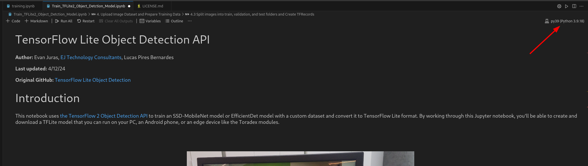

# Train a custom object detection, including Toradex modules, with TensorFlow Lite Model Maker

To run the model, first you will need to train the model. The model scripts only works on Python versions below 3.9. So, it’s recommend to use `Conda` to install a virtual environmental in another version of Python, since using `Conda` is the easiest way to do this.

Please follow [Installing Conda](https://conda.io/projects/conda/en/latest/user-guide/install/index.html) to install Conda, then follow [Managing environments](https://conda.io/projects/conda/en/latest/user-guide/tasks/manage-environments.html#) to create a virtual environment with Python 3.9.

After activating your virtual environment with Python 3.9, install the ipykernel package within the virtual environment to run the Jupyter notebook.

`$ pip install ipykernel`

Inside VSCode, remember to change your virtual environmental to the one you created using Conda.

Then select your Python environment created.