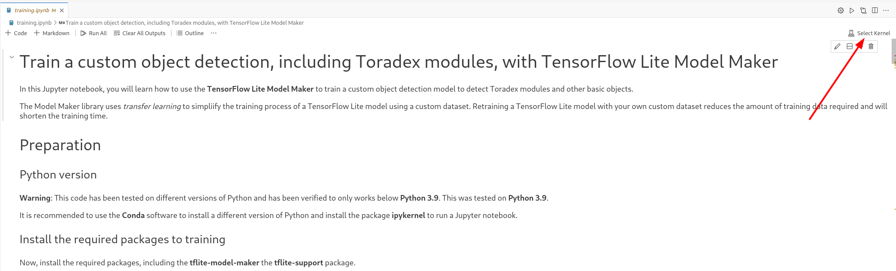

# Train a custom object detection, including Toradex modules, with TensorFlow Lite Model Maker

In this project, you will learn how to use the **TensorFlow Lite Model Maker** to train a custom object detection model to detect Toradex modules and other basic objects.

The Model Maker library uses *transfer learning* to simpliify the training process of a TensorFlow Lite model using a custom dataset. Retraining a TensorFlow Lite model with your own custom dataset reduces the amount of training data required and will shorten the training time.

To run the training notebook, first, follow this steps:

# Create and set virtual environment
To run the model, first you will need to train the model. The model scripts only works on Python versions below 3.9. So, it’s recommend to use Conda to install a virtual environmental in another version of Python, since using Conda is the easiest way to do this.

Please follow [Installing Conda](https://conda.io/projects/conda/en/latest/user-guide/install/index.html) to install Conda, then follow [Managing environments](https://conda.io/projects/conda/en/latest/user-guide/tasks/manage-environments.html#) to create a virtual environment with Python 3.9.

After activating your virtual environment with Python 3.9, install the ipykernel package within the virtual environment to run the Jupyter notebook.

`$ pip install ipykernel`

In VSCode, remember to change your virtual environmental to the one you created using Conda.



Then select your Python environment created.

# Label your dataset

You can run this script without any modifications. It will download an example dataset containing part of the [VOC2012 dataset](http://host.robots.ox.ac.uk/pascal/VOC/voc2012/) and photos of Toradex modules. It will perform training with the [EfficientDet architecture](https://arxiv.org/abs/1911.09070) and return a TensorFlow Lite (.tflite) file.

If you want to train your custom dataset, it’s recommeded to use labelImg to label your images. You can install it using:

`$ pip install labelImg`

Then run **labelImg** just typing in your bash:

`$ labelImg`

In labelImg program, make sure to save the annotations in **PascalVOC**. Also, the annotations must be in the same folder of the images, like this:

```
your_workspace$ tree voc_som_dataset/
voc_som_dataset/
├── test
│   ├── 2007_000738_jpg.rf.68e7dadc4e8ad97496ef6e83775e9bc7.jpg
│   ├── 2007_000738_jpg.rf.68e7dadc4e8ad97496ef6e83775e9bc7.xml
│   ├── 2007_000804_jpg.rf.1ce9806ad2a595855ebae507faa316b6.jpg
│   └── 2007_000804_jpg.rf.1ce9806ad2a595855ebae507faa316b6.xml
├── train
│   ├── 2007_000032_jpg.rf.c89cebf522d7060260245f453d6f6b1d.jpg
│   ├── 2007_000032_jpg.rf.c89cebf522d7060260245f453d6f6b1d.xml
│   ├── 2007_000033_jpg.rf.20b3484bf259f2167f3b0297e47553fc.jpg
│   └── 2007_000033_jpg.rf.20b3484bf259f2167f3b0297e47553fc.xml
└── valid
    ├── 2007_000027_jpg.rf.c3f4d0fd4522ab2611b623d57c5f1f9d.jpg
    ├── 2007_000027_jpg.rf.c3f4d0fd4522ab2611b623d57c5f1f9d.xml
    ├── 2007_000039_jpg.rf.d24f21c171085ed0e638f68b34b25e0b.jpg
    └── 2007_000039_jpg.rf.d24f21c171085ed0e638f68b34b25e0b.xml

4 directories, 12 files
```

Also, you will nead to put your labels in alphabetic order when loading the dataset.

You can use the script **script_take_labels.sh** to take the labels of your annotation. Make sure to put your path on this.

# Run the training script

Now, you are able to run the Jupyter notebook. It will generate a **.tflite** file, which you can test in the final of the notebook and will be used later to run this model in Toradex modules.

# Run the model on Toradex modules

To run the model on the Toradex modules, first download the repository:

`$ git clone git@github.com:lucasbernardestoradex/objectDetectionTorizon.git`

Now, go to the another repository and follow the instructions.